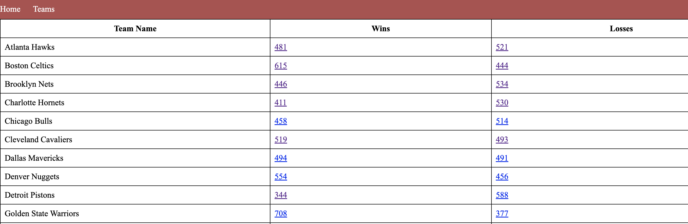
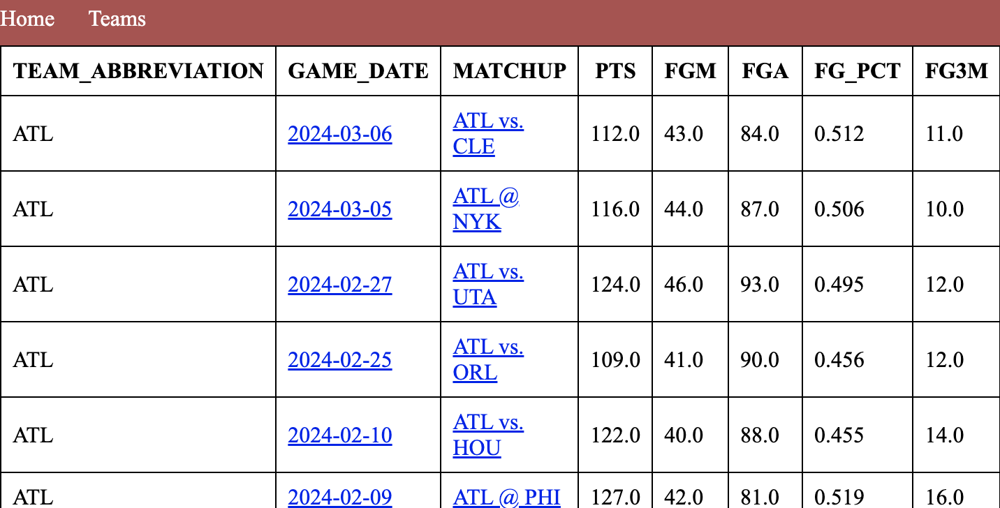
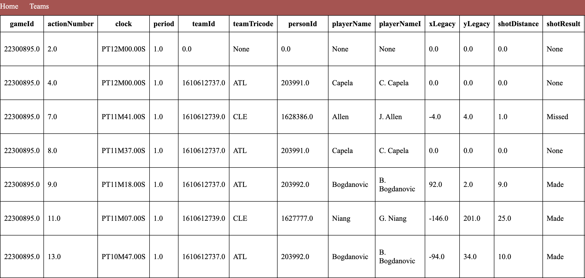
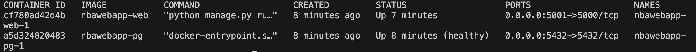

# Creating an NBA Web APP With the NBA API

## Introduction

This project serves as a tool to search up game specific information for each team of the NBA. The web app displays live game data of the current day. It also displays win loss records for each team and box scores of each won/lost game. For a more detailed analysis, you can also find specific play by play data for each game.

This project is built using the NBA API, SQL, Docker, and Jinja. First, relevant data is scraped using the NBA API, then stored in a PostgresSQL database. In total, there are nine tables that serve as the backend of the project. They contain player, team, and game information that are displayed on the website.

### Main Team Route:
 


### Example of Box Score Display:
 

### Example of Play By Play Display:
 


## NBA API

The NBA API used for this project can be found <a href = "https://github.com/swar/nba_api">here</a>. 

### Endpoints

| Endpoint | Description |
| ----------- | ----------- |
| **LeagueGameFinder**            | Returns all games of the NBA. |
| **BoxScoreTraditionalV3**       | Returns game, team, and player information on an individual game level. |
| **PlayerCareerStats**           | Returns player stats such as free throw percentage, three-point percentage, rebounds, etc. |
| **PlayByPlayV3**                | Returns each action of a game such as fouls made, shooting locations, scores at each play. |
| **CommonPlayerInfo**            | Returns basic player information such as name, team, draft number, birthday, etc. |
| **Players**                     | Returns all players of the NBA. |
| **Teams**                       | Returns all teams of the NBA. |

## Docker

This project relies on Docker for testing and deploying code. The project is split into two different containers - one for the database and one for the actual website. 

## SQL Database

All of the scraped data is stored inside a Postgres database. Each endpoint corresponds with a different table in the database. During the scraping, the data saves as CSV files. They are then converted to SQL files, and indexes are created on specific columns in each table. Primarily, indexes were created on columns that contained the game id, player id, team id, and win/loss recrod. The benefit of having a PostgresSQL database is that the data is easily accessible through querying, and tables can be joined together to provide more in depth information.

### List of Relations :

| Name | Number of Rows |
| ----------- | ----------- |
| **games**            | 30000 |
| **playercareerstats**       | 4875 |
| **playerinfo**           | 4900 |
| **players**                | 4900 |
| **playoffboxscores**            | 55036 |
| **playoffspbp**                     | 658381|
| **regseasonboxscores**                       | 383904 |
| **regseasonpbp**                     | 6444243 |
| **teams**                     | 30 |


## Getting Started

### 1. Clone the Repository

```
git clone https://github.com/sophiahuangg/nbawebapp.git
```

### 2. Build up Docker

```
docker-compose up -d --build
```

This command builds the project and creates all of the SQL schemas. Once you see an output similar to the image below, the project is done building. You can then move on to the next step. As you may notice, this project is separated into two containers like mentioned before - one for the web and one for the database. The web service relies on the pg service, which creates all of the databases, to be correctly working before bulding. This is because the web service needs to run Python code that assumes the existence of the tables in the database already.

#### Output:

 

### 3. Load the Data From the Root Directory

```
sh src/load_data.sh
```

The command `docker-compose up -d --build` creates the SQL schemas, but without running the shell script that loads the data, all of the tables will be empty. This command copies all of the CSV data into their respective SQL tables. The lines that do this within the shell script are in the form `docker-compose exec pg psql -U user -d postgres -c "\COPY '$tablename' FROM '$csv' WITH CSV HEADER;"`, where '$tablename' is replaced with the actual table name. 

For purposes of being able to upload the datasets onto Github, the playbyplay data have been split up into separate CSVs by the first four values of their gameId as well as whether the data is from the regular season or playoffs season. The CSVs are then compressed as zip files. The load_data.sh is also responsible for unzipping these zip files and extracting all of the CSVs for the playbyplay data. After each playbyplay CSV is copied onto a SQL table, the CSV files are then automatically removed through the command `rm "$csv"`. 

### 4. Navigate to the Web Browser

<a href = "http://127.0.0.1:5001"> http://127.0.0.1:5001 </a>

Once the shell script has loaded all of the ncessary data, you should be able to navigate to the provided link and have access to the web app! 

## Future Improvements/Drawbacks

1. Improving the frontend design of this project: have an easy to navigate website with more specific filters that would allow users to see more in-depth and specific data based on their requests.

2. Automating the process of loading data into the PostgresSQL databases instead of needing to run another shell script that loads in the data. 

3. Automating dataset creation to contain up to date information.

4. Create more indexes to speed up querying.