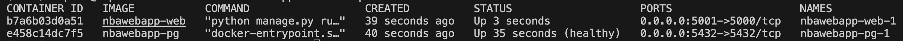

# Creating an NBA Web APP With the NBA API

## Introduction

This project serves as a tool to search up game specific information for each team of the NBA. The web app displays live game data of the current day. It also displays win loss records for each team and box scores of each won/lost game. For a more detailed analysis, you can also find specific play by play data for each game.

This project is built using the NBA API, SQL, Docker, and Jinja. First, relevant data is scraped using the NBA API, then stored in a PostgresSQL database. In total, there are nine tables that serve as the backend of the project. They contain player, team, and game information that are displayed on the website.

## NBA API

The NBA API used for this project can be found <a href = "https://github.com/swar/nba_api">here</a>. 

### Endpoints

| Endpoint | Description |
| ----------- | ----------- |
| **LeagueGameFinder**            | Returns all games of the NBA. |
| **BoxScoreTraditionalV3**       | Returns game, team, and player information on an individual game level. |
| **PlayerCareerStats**           | Returns player stats such as free throw percentage, three-point percentage, rebounds, etc. |
| **PlayByPlayV3**                | Returns each action of a game such as fouls made, shooting locations, scores at each play. |
| **CommonPlayerInfo**            | Returns basic player information such as name, team, draft number, birthday, etc. |
| **Players**                     | Returns all players of the NBA. |
| **Teams**                       | Returns all teams of the NBA. |

## Docker

This project relies on Docker for testing and deploying code. 

## SQL Database

All of the scraped data is stored inside a Postgres database. Each endpoint corresponds with a different table in the database. During the scraping, the data saves as CSV files. They are then converted to SQL files and indexes are created on specific columns in each table. Primarily, indexes were created on columns that contained the game id, player id, team id, and win/loss recrod. The benefit of having a PostgresSQL database is that the data is easily accessible through querying, and tables can be joined together to provide more in depth information.

## Getting Started

### 1. Clone the Repository

```
git clone https://github.com/sophiahuangg/seniorthesis.git
```

### 2. Build up Docker

```
docker-compose up -d --build
```

#### Output:

 

### 3. Load the Data From the Root Directory

```
sh src/load_data.sh
```

### 4. Navigate to the Web Browser

<a href = "http://127.0.0.1:5001"> http://127.0.0.1:5001 </a>

## Future Improvements/Drawbacks

1. Improving the frontend design of this project: have an easy to navigate website with more specific filters that would allow users to see more in-depth and specific data based on their requests.

2. Automating the process of loading data into the PostgresSQL databases instead of needing to run another shell script that loads in the data. 

3. Automating dataset creation to contain up to date information.